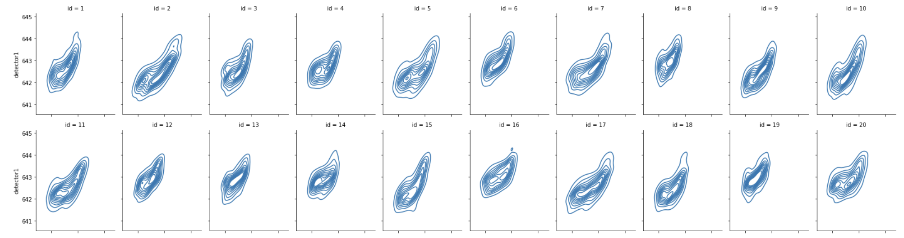
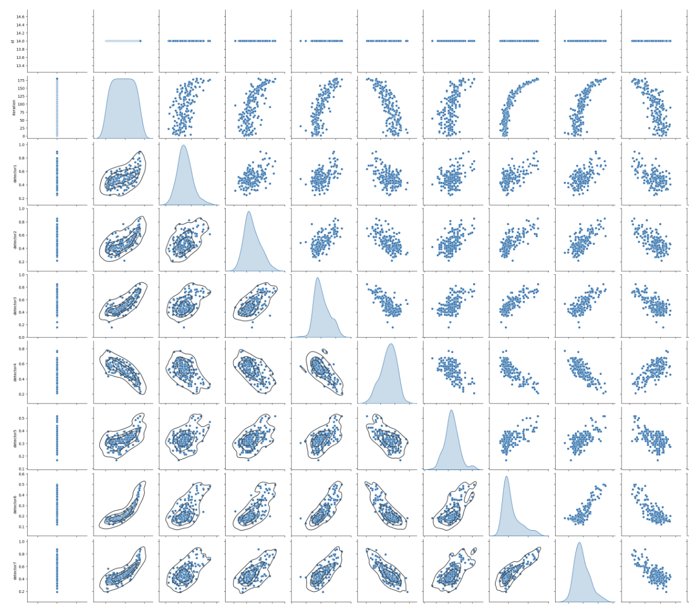
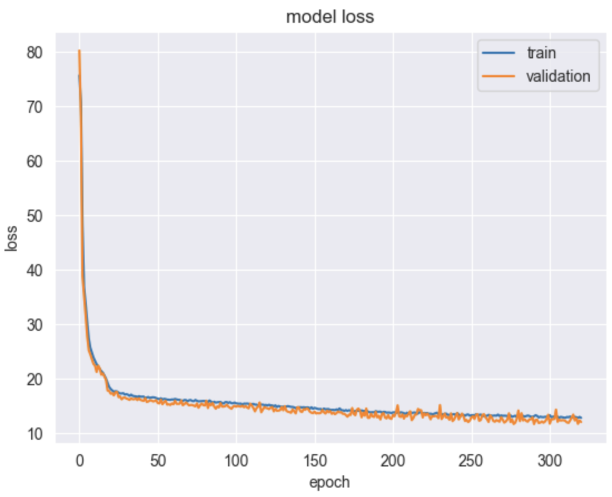
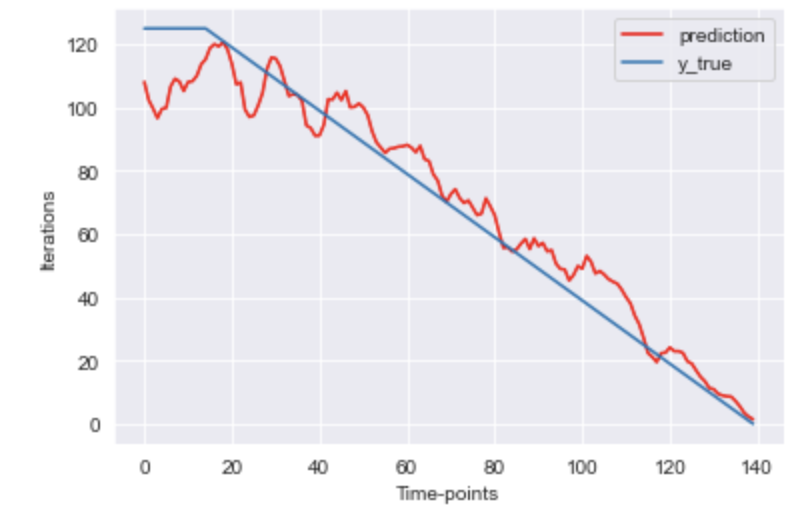

# CNN-based real-time Device Lifetime Estimation
The goal of the project is to predict the Remaining Useful Lifetime (RUL) of a device, based on the data collected from its sensors during a time series.
The prediction is done using the `Conv1D-based` model.

## Dataset
Train data includes Remaining Useful Lifetime data from ~100 different devices, each with a unique id. A time series, with a number representing RUL for each moment of the time, is given under a single device ID. The subset of data (only id 14) is used as a training dataset. Our goal is to predict accurate RUL numbers for the time series of the test dataset. Before training or evaluation, data is normalized using min-max scaling.

The following plot represents the behavior of `detector1` on the first 20 IDs.

  

The following plot represents the correlation between the first 7 detectors:

  

## Training/Prediction Processes
It is needed to predict the RUL number based on the previous `40-time` points. For that, the train dataset should be divided into blocks of length 40 (i ... i+40, i+1 ... i+1+40, ....), and take as labels the i+40th RUL number. This means, that each time interval of length 40 has to correspond to the first RUL number starting from the end of this interval. We feed a (len(k-th id)-40) x 40 x num_features matrix into the model as an input and 1 x (len(k-th id)-40) array of true labels, and fit the model for each id. During inference, for each t time-point, an array of [t-40: t] moments is taken by the model as an input, and the output is the RUL for (t+1) - th time moment.

The plot of the losses (val and training) during 300+ epochs.

  

## Metrics
Evaluation is done using RMSD (Root Mean Square Deviation). That is the rounded mean of the MSE vector between test labels and predictions.

$$
\text{RMSD} = \sqrt{\frac{\left(\sum{t=1}^{T} (x_{1,t} - x_{2,t})\right)^2}{T}}
$$

## Results
This plot shows the predictions for each time interval on the test data (14th id) (0 ... 40, 1 ... 41, ....), for the moments (41, 42, .....)

  

